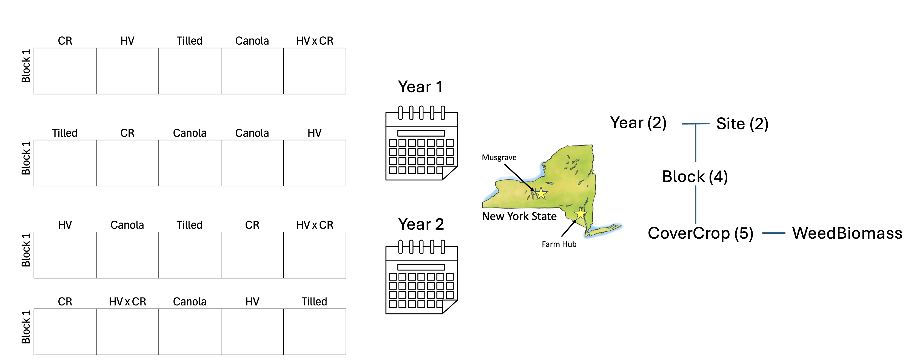
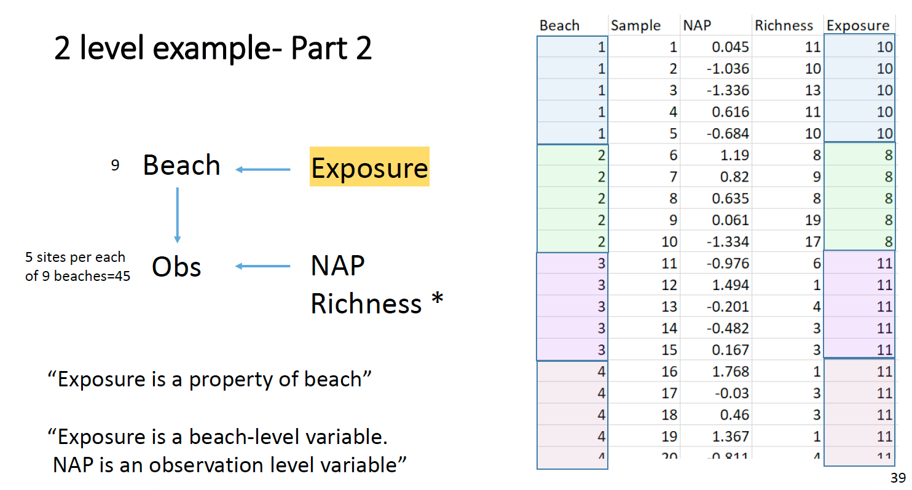

# Loading

```{r Packages}
library(lmerTest)
library(performance)
library(glmmTMB)
library(DHARMa)
library(ADER)
library(tidyverse)

options(contrasts = c("contr.sum", "contr.poly")) #setting contrasts
```

Today we will be using two data frames:

1.  A subset of data published in Menalled et al. (2023): <https://doi.org/10.1038/s41598-023-43987-x>

    This experiment looks at changes in weed communities across 10 cover crop treatments (5 summer cover crop treatments, 5 winter cover crop treatments). Today, we will just work with winter cover crops (i.e. tilled control, canola, cereal rye (CR), hairy vetch (HV), and HV x CR mix).

2.  Richness of species in 45 sampling stations along the coastline of The Netherlands, measured by two researches of the the RIKZ (Rijksinstituut voor Kust en Zee), i.e., the Dutch Institute for Coastal and Marine Management.

# Cover Crop example

```{r Data, echo = T, results = 'hide'}
#Each year is stored separately, I'll load them in, calculate total weed biomass, and combined the data frames
WintData1_tmp <- read.csv("https://ecommons.cornell.edu/server/api/core/bitstreams/adb24a0c-0b2c-4bd6-90ad-e203c270bba3/content")
WintData2_tmp <- read.csv("https://ecommons.cornell.edu/server/api/core/bitstreams/f05bf7b9-3c15-48ec-9f28-0c978cf0560b/content")

str(WintData1_tmp) #loaded in nicely
str(WintData2_tmp) #loaded in nicely

#We don't want to do weed community analysis today, just simple models of total weed biomass
WintData1 <-
  WintData1_tmp %>% 
  rowwise() %>%
  mutate(WeedBiomass = sum(c_across(-c(Trial, Year, Site, Block, Plot, CoverCrop, CoverCropBiomass, canola, 
                                       cereal.rye, hairy.vetch)), na.rm = FALSE)) %>% 
  ungroup() %>% 
  select(Year, Site, Block, Plot, CoverCrop,WeedBiomass)

WintData2 <-
  WintData2_tmp %>% 
  rowwise() %>%
  mutate(WeedBiomass = sum(c_across(-c(Trial, Year, Site, Block, Plot, CoverCrop, CoverCropBiomass, canola, 
                                       cereal.rye, hairy.vetch)), na.rm = FALSE)) %>%
  ungroup() %>% 
  select(Year, Site, Block, Plot, CoverCrop,WeedBiomass)

#Combine data frames
WintData_tmp <- bind_rows(WintData1,WintData2)

WintData <- WintData_tmp %>% mutate(across(-WeedBiomass, as.factor))
str(WintData) #looks good!
```

#Modeling

I want to see how weed biomass is impacted by cover crop treatment, basically WeedBiomass\~CoverCrop. However, my experiment has clear nesting! I must account for non-independence through a model with more fixed and/or random effects. Looking at my experimental design (picture below) we can see that there are **three** *total* levels.

1.  Site and Year are at an equal level because both sites are in both years and visa versa. there are 2 levels of each site and year

2.  Block is within Site and Year. I know this because we used different fields in each site year, so block 1 in Musgrave during year 1 **is not** the same as block 1 in Musgrave during year 2. Because each block is within a unique site year, there are 2 sites x 2 years x 4 blocks = 16 groups.

3.  Cover crop treatments are within blocks, this is the level at which I made my observations.

As nice it would be to account for Site and Year through a random effect, we don't have enough levels of either group. Remember we need at least three groups per variable for it to be a random effect. Thus, these variables will be fixed effects. On the other hand, site.year has 4 groups (iffy, but let's just try) and block has 16 levels across site-years (nice, that's a solid amount of groups for a RE). As for CoverCrop, this is the level of observation, it does not need to be a random effect.

{width="452"}

```{r modeling}
#create Site.Year variable
WintData$Site.Year <- paste(WintData$Site,WintData$Year,sep = ".")
WintData$Site.Year <- as.factor(WintData$Site.Year)


#let's get a sense of what we are working with...
#We'll probably be working with a Tweedie glmer because 
plot(WeedBiomass~1, data = WintData) #a cluster of points with near zero weed biomass, probably 
plot(WeedBiomass~CoverCrop*Site*Year, data = WintData) #non-normally distributed around treatments

#let's get modeling

#simple lmer first
WeedBio_Mod1 <- lmer(WeedBiomass~Site*Year + CoverCrop + (1|Site.Year/Block), data = WintData)
#singularity issues from RE of Block:Site.Year = 0, could be okay if anova DF are good
summary(WeedBio_Mod1) #RE captured correctly because number of groups in RE follows design
plot(WeedBio_Mod1) #terrible, as expected
check_model(WeedBio_Mod1) #I'm mainly interested in pp_check (looks bad) and random effects check (looks okay)
anova(WeedBio_Mod1)


#now glmer
WeedBio_Mod2 <- glmmTMB(WeedBiomass~Site*Year + CoverCrop + (1|Site.Year/Block),
                        family = tweedie(link = "log"),
                        data = WintData)
summary(WeedBio_Mod2) #RE captured correctly because number of groups in RE follows design
simulateResiduals(WeedBio_Mod2, plot = TRUE) #much better, good enough to publish
check_model(WeedBio_Mod2) #pp_check still shows some error around 0. All RE look good. Good enough!
car::Anova(WeedBio_Mod2, type = 3)
```

# Beach example

The RIKZ data set is a great way to look at denominator degrees of freedom. In this experiment, researchers looked at species richness (Richness) across the altitude (NAP) and sun exposure (Exposure). Exposure is the same with each beach. Because you have repeated measurements at the beach level, non-independence at this level should be accounted for, let's use a random effect. In this case, observations at this level (Exposure) should have denominator degrees of freedom that less than the beach level (i.e., less than 9).

{width="466"}

```{r data & modeling}
data("RIKZ")
RIKZ_Wide <- RIKZ
str(RIKZ_Wide) #C2 - I5 are species

RIKZ_Long <-
  RIKZ_Wide %>% 
  mutate(across(C1:I5, ~ if_else(. > 0, 1, 0)),
         Sample = rep(1:5,9),
         Richness = rowSums(across(C1:I5)),
         Exposure = exposure) %>% 
  select(Beach, Sample, Exposure, NAP, Richness) 

RIKZ_Mod1 <- lmer(Richness ~ NAP + Exposure +  (1|Beach), data = RIKZ_Long)
summary(RIKZ_Mod1)
anova(RIKZ_Mod1)
```

When you have observations at multiple levels , like what we see in the RIKZ data, singularity in the random effects can cause issues with denominator degrees of freedom calculation. This is a *huge deal* as ANOVA is using degrees of freedom to calculate p-values.
```{r singularity}
#randomly shuffling beach around so that it accounts for no variance
RIKZ_Long <-
  RIKZ_Long %>% 
  mutate(Beach2 = rep(sample(1:5), 9))
RIKZ_Mod2 <- lmer(Richness ~ NAP + Exposure + (1|Beach2),
                  data = RIKZ_Long)
summary(RIKZ_Mod2) #singularity warning shows that beach accounts for no variance
anova(RIKZ_Mod2) #df for exposure is WRONGE, notice that Satterthwaite's method is used
anova(RIKZ_Mod2, ddf = "Kenward-Roger") #Kenward-Roger denominator degrees of freedom will help solve this issue, often for real data—when there is some very small amount of variance—the impact of a Kenward-Roger is stronger. Unfortunately, there isn't a way to do a Kenward-Rodger in car::Anova(), at least to my knowledge...

```
