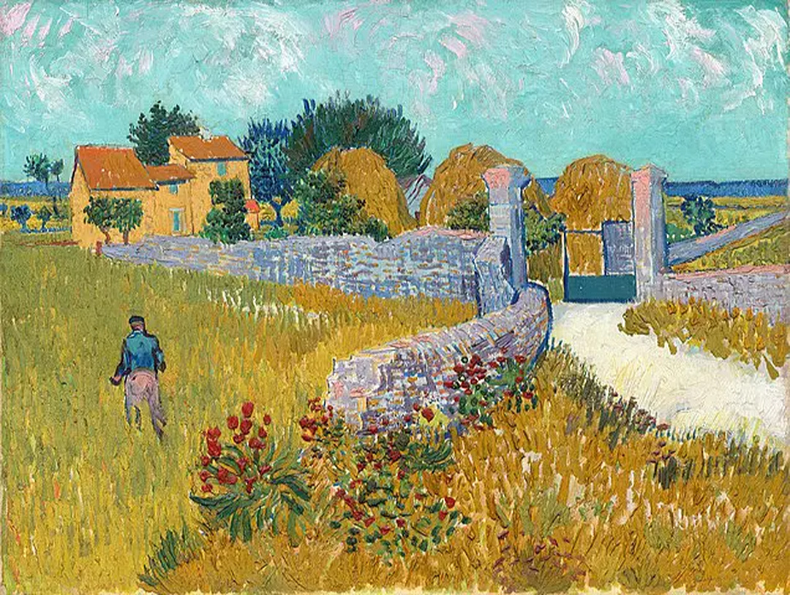

```{r}
#| label: Packages

library(tidymodels)
library(tidyverse)
library(embed)
library(lme4)
library(rsample)
library(ranger)

set.seed(42)
```

## Introduction {.smaller}

:::{.incremental}
- Often data come from experiments with a hierarchial structure

- Hierarchial structure causes data-points to not meet the assumptions of independence as observations from the same group will be correlated to one another
:::
. . .

::::: {.columns}
:::: {.column width="50%"}
{style="object-fit: cover; width: 100%; height: 250px; display: block; margin: auto"}
::::
:::: {.column width="50%"}
{style="object-fit: cover; width: 100%; height: 250px; display: block; margin: auto"}
::::
:::::

For example, if you were sampling yield in these different fields, observations within the same field would be correlated to one another.

## Introduction {.smaller}
:::{.incremental}
**Random effects can solve this issue**

- **The issue**: Observations nested within groups (fields, varieties, blocks) are not independent

- **Naiveté**: Treating nested data as independent leads to underestimated standard errors and spuriously significant results

- **Random Effects Solution**: Allows each group to have its own deviation from the population intercept (or slope), capturing within-group correlation structure

- **Modeling Group Variation**: Instead of treating group membership as a fixed categorical variable, random effects estimate group-specific offsets while sharing information across groups via a shared probability distribution

- **Proper Standard Errors**: By accounting for within-group correlation, random effects yield valid confidence intervals and p-values

- **Efficiency Gain**: Partial pooling (shrinkage) of group estimates improves precision compared to fitting completely separate models per group
:::


##
- I will create a synthetic agronomic experiment looking at yield across 5 fields with 3 obs each

- The resulting data (`dat`) is has a hierarchical structure: observations *nested* within fields

```{r}
#| label: simp dataframe
#| echo: false

# Crop yield measured at 5 fields, 3 obs each
dat <- data.frame(
    field = rep(c("A", "B", "C"),each = 3),
    fertilizer = c(10, 20, 30, 10, 20, 30, 10, 20, 30),
    yield = c(
        2, 3, 4, # field A — average; group mean = 3
        5, 6, 7, # field B — high-yielding; group mean = 6
        3, 4, 5)) # field C — average; group mean = 4

dat
```


## The simple model

This is a random-intercept-only model where a horizontal line is fit to the grand mean of the data (i.e. yield = 4.33).

```{r}
#| label: simp model
#| echo: true

fit_simp <- lmer(yield ~ 1 + (1 | field), data = dat)
```


```{r}
#| label: simp model plot
#| fig.align: center

hist(dat$yield, main = NULL, xlab = "Yield", cex.lab = 1.5)
abline(v = fixef(fit_simp), col = "red", lwd = 4)
legend("topright", legend = "grand mean", col = "red", lwd = 4, bty = "n", cex = 1.5)
invisible(dev.off())
```

## BLUPs: Definition
- **Best Linear Unbiased Predictions of Random Effects (BLUPs):** A method that is used in linear mixed models for the estimation of random effects

- When combined with fixed effect estimates, BLUPs are used to calculate the model predictions. Basically, the model is saying: *Give the fixed and random effects of an observation, this is my prediction of its value*


## BLUPs: Formula
::: {style="font-size: 60%;"}
$$\text{BLUP}_i = \lambda_i (\bar{y}_i - \mu)$$

where $\lambda_i = \frac{\sigma^2_u}{\sigma^2_u + \sigma^2_e / n_i}$ is the shrinkage factor.

- $\lambda_i$ = shrinkage factor = $\frac{\sigma^2_u}{\sigma^2_u + \sigma^2_e / n_i}$

- $\sigma^2_u$ = between-group variance

- $\sigma^2_e$ = residual (within-group) variance

- $n_i$ = number of observations in group $i$

- $\bar{y}_i$ = mean observation for group $i$

- $\mu$ = fixed intercept (grand mean from `fixef()`)


- **Shrinkage factor** ($\lambda$): Controls how much to trust group-specific data

  - $\lambda \approx 1$ → high between-group variance → trust data more

  - $\lambda < 1$ → low between-group variance → shrink toward grand mean
:::

## BLUPs: Manual calculation {.smaller}

```{r}
#| label: BLUP manual
#| echo: true

# Extract variance components
vc     <- as.data.frame(VarCorr(fit_simp))
sigma2_u <- vc$vcov[1]   # between-group variance
sigma2_e <- vc$vcov[2]   # residual variance
mu_hat   <- fixef(fit_simp)   # grand mean (could be a fixed intercept)

# Compute BLUPs manually
blups <- dat |>
  summarise(
    ybar = mean(yield),
    n    = n(),
    .by  = field
  ) |>
  mutate(
    lambda = sigma2_u / (sigma2_u + sigma2_e / n),  # shrinkage factor
    blup   = lambda * (ybar - mu_hat)
  )

blups
```

## BLUPs: R calculation

Or much simpler, in R:

```{r}
#| label: BLUP auto
#| echo: true

ranef(fit_simp)$field
```

## BLUPs and model predictions {.smaller}

By combinding BLUPs with the model coefficients, we can manually get model predictions.

```{r}
#| label: BLUP and FE
#| echo: true

fixef(fit_simp) + ranef(fit_simp)$field
```

The code above tells us that there should be three unique values predicted from the model: **3.19** for field A, **5.76** for field B, and **4.04** for field C.

When we look at the model predictions we can see that this is what is found!

```{r}
#| label: BLUP and Pred
#| echo: true
#| output-location: column

data.frame(
  obs = names(predict(fit_simp)),
  pred = predict(fit_simp))
```

## Conclusions

:::::{.columns}

::::{.column width="60%"}

:::{.callout-tip title="Non-independence from hierarchy must be dealt with"}
Nesting within experimental groups violates model assumptions
:::

:::{.callout-tip title="Random effects solve this issue"}
By taking into account relationships between treatment means, variation within and between groups, and sample size
:::

::::

::::{.column width="40%"}
:::{style="text-align: center;"}
{fig-align=center width="60%"}
{fig-align=center width="60%"}
:::
::::
:::::
